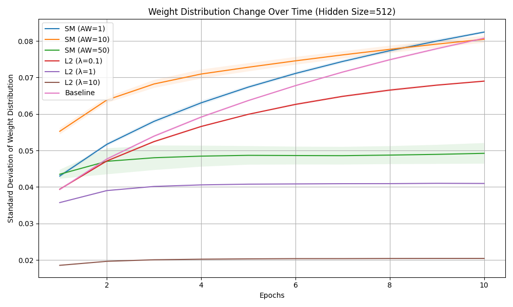
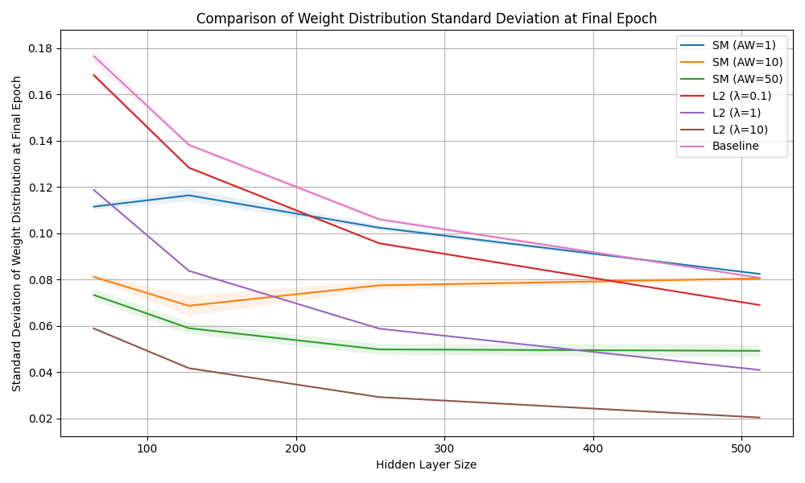
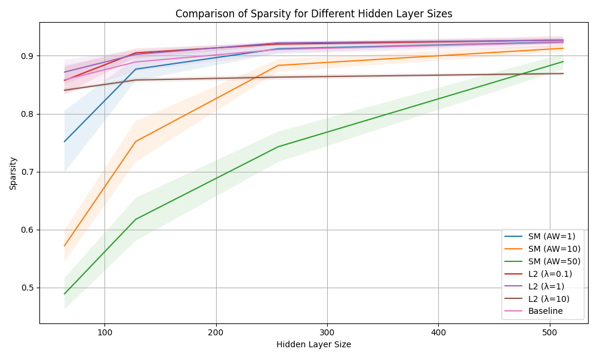
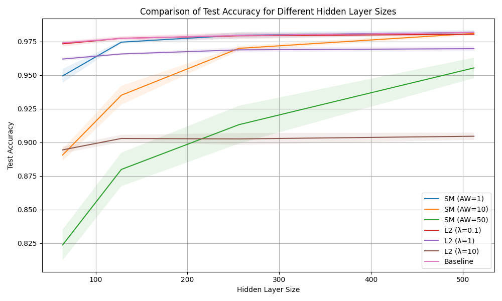

# Self-Modeling MLP for MNIST Classification

This project is a partial reproduction of the experiments described in the paper ["Unexpected Benefits of Self-Modeling in Neural Systems"](https://arxiv.org/abs/2407.10188), focusing specifically on the MNIST dataset. I also extend the original work by comparing the self-modeling approach with L2 regularization.

## Overview

I implement a Multi-Layer Perceptron (MLP) with self-modeling for MNIST digit classification. The self-modeling task is an auxiliary objective where the network learns to predict its own internal states. This project aims to investigate whether self-modeling leads to improved regularization and performance compared to standard training and L2 regularization.

## Requirements

To install the required dependencies, run:

```
pip install -r requirements.txt
```

## Running the Experiment

To run the experiment, execute:

```
python -m src.model.train
```

This script will train three models:
1. A standard MLP
2. An MLP with self-modeling
3. An MLP with L2 regularization

After training, the script will compare the complexity and accuracy of the models, and generate plots to visualize the results.

## Results

The experiment results, including accuracy comparisons and complexity measures, will be saved in the `results` directory.

Here are the example results:

### Weight Distribution Change Over Time:



### Final Weight Distribution Standard Deviation:



### Sparsity Comparison:


Sparsity is measured using a pruning-based method, where higher values indicate that the model maintains good performance even with more weights pruned. This method is used for simplicity instead of the RLCT measure employed in the original paper.

### Test Accuracy Comparison:



## References

Premakumar, V. N., Vaiana, M., Pop, F., Rosenblatt, J., de Lucena, D. S., Ziman, K., & Graziano, M. S. A. (2024). Unexpected Benefits of Self-Modeling in Neural Systems. arXiv preprint arXiv:2407.10188.